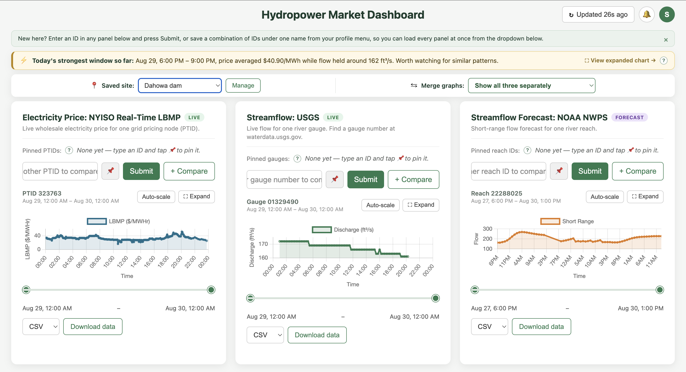

# Hydropower Market Dashboard

A live dashboard that overlays **river streamflow**, **wholesale electricity prices**, and **short-range flow forecasts** on one screen — so a hydropower operator or energy trader can see, at a glance, when water and price line up to make generation most valuable.

Built on three free, public, government data sources. No paid market-data subscriptions required.



## Why this exists

Hydropower generation decisions depend on two independent signals that are normally checked in two different places:

- **How much water is available** (streamflow), which determines how much power *can* be generated.
- **What that power is worth right now** (wholesale price), which determines whether it's worth generating.

This dashboard pulls both into one view, adds a forward-looking flow forecast, and layers in threshold-based alerting so you don't have to keep a browser tab open all day to catch a change.

## Features

- **Live data panels** for three independent sources, each pinnable, comparable, and searchable by ID:
  - **USGS streamflow** — real-time river discharge (cfs) at any USGS gauge.
  - **NYISO real-time LBMP** — live wholesale electricity price at any NY grid pricing node (PTID).
  - **NOAA NWPS short-range forecast** — National Water Model forecasted flow for a river reach.
- **Combined/overlay view** — merge any two panels onto one dual-axis timeline (e.g. price vs. streamflow) to visually spot correlation.
- **Revenue-window insight** — automatically highlights the strongest window of the day by price × flow, a rough proxy for relative generation value.
- **Saved sites** — bundle a gauge + PTID + reach under one name (e.g. "Niagara Falls Plant") and load all three panels together.
- **Threshold alerts** — set "notify me when X is above/below Y" per site and data source.
  - A background poller re-checks every 5 minutes, even with no browser open.
  - Edge-triggered, so a stuck violation doesn't spam repeat notifications.
  - Optional email delivery via any SMTP provider (Gmail app password, SendGrid, Mailgun, etc.).
- **In-app notification center** — bell icon with unread count and history.
- **Chart tools** — zoomable range slider, auto-scale toggle, CSV/JSON/XML export per panel.
- **Multi-user accounts** — signup/login with hashed passwords; each user has their own saved sites, alerts, and contact settings.
- **Historical persistence** — every fetched reading is upserted into Postgres, so data accumulates over time instead of being lost between fetches.

## Tech stack

- **Backend:** Python, Flask
- **Database:** PostgreSQL (via `psycopg2`)
- **Frontend:** Vanilla JavaScript, [Chart.js](https://www.chartjs.org/)
- **Auth:** Flask sessions, `werkzeug` password hashing
- **Email:** stdlib `smtplib` (generic SMTP, provider-agnostic)

## Project layout

```
app/
├── app.py              # Flask routes, external API fetch/clean logic, alert poller
├── db.py                # Postgres schema + queries
├── requirements.txt
├── static/
│   ├── script.js         # Dashboard UI logic, charts, alerts, saved sites
│   ├── start.js
│   └── style.css
└── templates/
    ├── index.html         # Main dashboard
    └── start.html         # Login / signup
```

## Data sources

| Source | What it provides | Docs |
|---|---|---|
| USGS Water Services | Real-time streamflow (discharge, cfs) | waterservices.usgs.gov |
| NYISO | Real-time locational-based marginal price (LBMP) | nyiso.com |
| NOAA NWPS | National Water Model short-range streamflow forecast | water.noaa.gov |

All three are free and require no API key.

## Setup

### Prerequisites

- Python 3.9+
- PostgreSQL running locally (or reachable via connection settings)

### Install

```bash
cd app
python3 -m venv .venv
source .venv/bin/activate
pip install -r requirements.txt
```

### Configure environment

Create `app/.env`:

```
DB_HOST=localhost
DB_PORT=5432
DB_NAME=water_data
DB_USER=postgres
DB_PASSWORD=your_password
SECRET_KEY=some_random_secret_key

# Optional — set to "true" to enable Flask's debug mode (auto-reload,
# interactive debugger). Leave unset/false anywhere reachable over the
# network — the debugger allows arbitrary code execution.
FLASK_DEBUG=false

# Optional — leave blank to skip real email sends (logged instead)
SMTP_HOST=
SMTP_PORT=587
SMTP_USERNAME=
SMTP_PASSWORD=
SMTP_FROM_EMAIL=
```

The app creates its own tables on startup (`users`, `saved_sites`, `alert_thresholds`, `alert_notifications`, and one table per data source) — no manual migrations needed.

### Run (development)

```bash
cd app
python app.py
```

Visit `http://localhost:5050`.

### Run (production)

The dev server above (`python app.py`) is not meant to handle real traffic or run unattended. Use gunicorn instead, as a single worker process — the background alert poller runs as a thread inside the process, so more than one worker would start a duplicate poller and send duplicate alert emails:

```bash
cd app
gunicorn app:app --bind 0.0.0.0:$PORT --workers 1
```

This is also captured in `app/Procfile` for platforms (Render, Heroku, etc.) that read it automatically.

## Usage

1. Sign up for an account.
2. In any panel, enter an ID (USGS gauge number, NYISO PTID, or NOAA reach ID) and hit Submit.
3. Pin frequently used IDs, or save a combination of all three under one site name from the profile menu.
4. Use "Merge graphs" to overlay two panels on one chart.
5. Open **Manage Alerts** from the profile menu to set thresholds and, optionally, email notifications.

## Industry relevance

This is a lightweight version of the kind of market-integration dashboards used at small-to-mid hydroelectric facilities, built entirely from free public data instead of paid feeds:

- **Generation scheduling** — decide when to run turbines based on both water availability and market price in one view, instead of checking separate government portals.
- **Revenue optimization** — the price × flow overlay approximates what an energy trading desk does manually to spot high-value generation windows.
- **Forecast-informed planning** — the NOAA short-range forecast lets an operator anticipate flow changes before they happen.
- **Proactive monitoring** — threshold alerts remove the need for constant manual checking, useful for smaller operators without a 24/7 control room.

## License

MIT — see [LICENSE](LICENSE).
